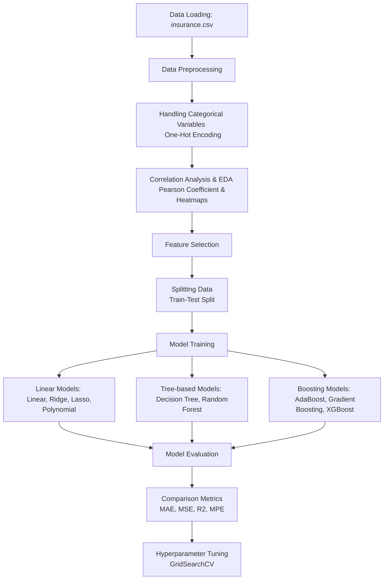

# Medical Insurance Cost Prediction

## Overview
This project predicts medical insurance costs using various machine learning regression models. It analyzes the relationship between personal attributes (such as age, BMI, smoking habits) and the charges billed by health insurance. Several regression techniques are applied to determine the best-performing model, with evaluations based on Mean Absolute Error (MAE), Mean Squared Error (MSE), R-squared ($R^2$), and Mean Percentage Error (MPE).

## Data
The dataset used in this project is `insurance (1).csv`. The dataset contains the following personal attributes:
- `age`: Age of primary beneficiary
- `sex`: Insurance contractor gender, female / male
- `bmi`: Body mass index
- `children`: Number of children covered by health insurance
- `smoker`: Smoking (yes / no)
- `region`: The beneficiary's residential area in the US (northeast, southeast, southwest, northwest).
- `charges`: Individual medical costs billed by health insurance (Target Variable)

## Workflow



## Methodology
The project explores multiple configurations:
1. **Feature Subsets**: Models trained on **all variables** vs. **most significant variables** (`age`, `bmi`, `smoker`).
2. **Standardization**: Training pipelines comparing **with standard scaling** vs. **without scaling** to identify its impact on different architectures.

## Models Evaluated
The following algorithms are trained and compared:
- Linear Regression
- Polynomial Regression (Degree = 2)
- Ridge Regression
- Lasso Regression
- Random Forest Regressor
- Decision Tree Regressor
- AdaBoost Regressor
- Gradient Boosting Regressor
- XGBoost Regressor

## Installation & Setup

1. **Clone the Repository or setup the workspace.** Make sure the files are present in your workspace:
   - `InsurancePricePrediction_code.ipynb`
   - `insurance (1).csv`

2. **Install Required Libraries**: Ensure you have Python installed, then install the dependencies.
   ```bash
   pip install pandas numpy matplotlib seaborn scikit-learn xgboost tabulate scipy
   ```

3. **Running the Notebook**:
   - Open Jupyter Notebook:
     ```bash
     jupyter notebook
     ```
   - Open the `InsurancePricePrediction_code.ipynb` notebook.
   - Run all cells to process the data, train the models, and view the comparison metrics and scatter plots. (Tip: Use `Ctrl+F9` to run all cells if in an environment that supports it like Colab).

## Results
The project provides comprehensive outputs through `tabulate` tables showing continuous metrics of the tested algorithms, side-by-side with scatter plots comparing the 'Actual vs. Predicted' charges for every tested algorithm.
