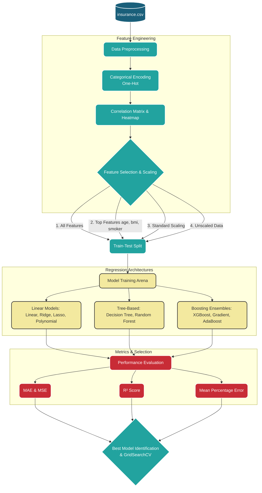

<div align="center">
  <h1>🩺 Medical Insurance Cost Prediction</h1>
  <p><strong>An end-to-end Machine Learning pipeline utilizing 9 regression architectures to accurately forecast health insurance premiums based on demographic and lifestyle factors.</strong></p>
  
  [](https://www.python.org)
  [](https://scikit-learn.org/)
  [](https://xgboost.readthedocs.io/)
  [](https://jupyter.org/)
</div>

---

## 🎯 Executive Summary for Reviewers
This project demonstrates proficiency in **Exploratory Data Analysis (EDA), Feature Engineering, and Applied Predictive Modeling**. By systematically preprocessing data (handling categorical variables, scaling) and evaluating multiple regression models—from standard Linear Regression to advanced ensembles like **XGBoost and Gradient Boosting**—this repository serves as a blueprint for solving continuous variable prediction problems.

<details>
<summary><b>💡 Core Takeaways (Click to Expand)</b></summary>

- **Robust Preprocessing**: Includes One-Hot Encoding and explicit mitigation of the Dummy Variable Trap.
- **Statistical Rigor**: Feature selection validated through Pearson Correlation Coefficients & P-values.
- **Comprehensive Evaluation**: Models are judged across 4 key metrics: `MAE`, `MSE`, `R²`, and `MPE` (Mean Percentage Error).
- **Ablation Studies**: Tests the isolated impacts of feature scaling (StandardScaler) and feature selection (All vs. Top 3 features).
</details>

---

## 🏗️ System Architecture & Data Flow

The following interactive flowchart maps out the end-to-end machine learning lifecycle implemented in the notebook.



---

## 📊 Dataset Overview

The dataset (`insurance (1).csv`) dictates the individual medical costs billed by health insurance.

| Feature | DataType | Description |
| :--- | :--- | :--- |
| **`age`** | `Numeric` | Age of primary beneficiary. |
| **`sex`** | `Categorical` | Insurance contractor gender (female / male). |
| **`bmi`** | `Numeric` | Body mass index (ideal range: 18.5 - 24.9). |
| **`children`**| `Numeric` | Number of kids/dependents covered by insurance. |
| **`smoker`** | `Categorical` | Smoking status (yes / no). |
| **`region`** | `Categorical` | Beneficiary's residential area in the US (NE, SE, SW, NW). |
| **`charges`** | `Numeric` | **Target Variable:** Medical costs billed. |

---

## 🚀 Quick Start & Installation

To run this project locally and explore the predictive models:

**1. Clone the environment and navigate to the directory**
Ensure you are in the `Medical-Insurance-Cost-Prediction` workspace.

**2. Install Dependencies**
```bash
pip install pandas numpy matplotlib seaborn scikit-learn xgboost tabulate scipy
```

**3. Launch the Pipeline**
Run the Jupyter Notebook to execute the data flow.
```bash
jupyter notebook InsurancePricePrediction_code.ipynb
```
*(Pro-tip: Inside the notebook, hit `Ctrl + F9` or `Cell -> Run All` to execute the full pipeline and generate the comparative Actual vs. Predicted scatter plots).*

---

## 🔍 Key Findings (Spoiler Alert)

- **Smoking is heavily correlated** with higher insurance charges, acting as the primary pivot node in tree-based architectures.
- Complex ensemble models (like **Gradient Boosting** and **XGBoost**) tend to outperform basic linear regression, particularly when navigating the non-linear relationship between BMI, smoking status, and charges.
- **Standard Scaling** produces varying impacts depending on the architecture; linear methods (Ridge, Lasso) stabilize, whereas tree-based ensembles handle unscaled data natively without performance degradation.
